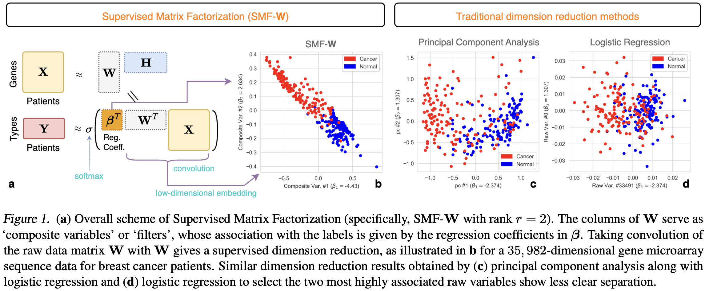
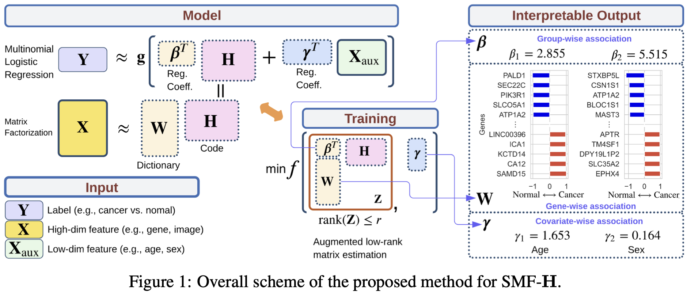
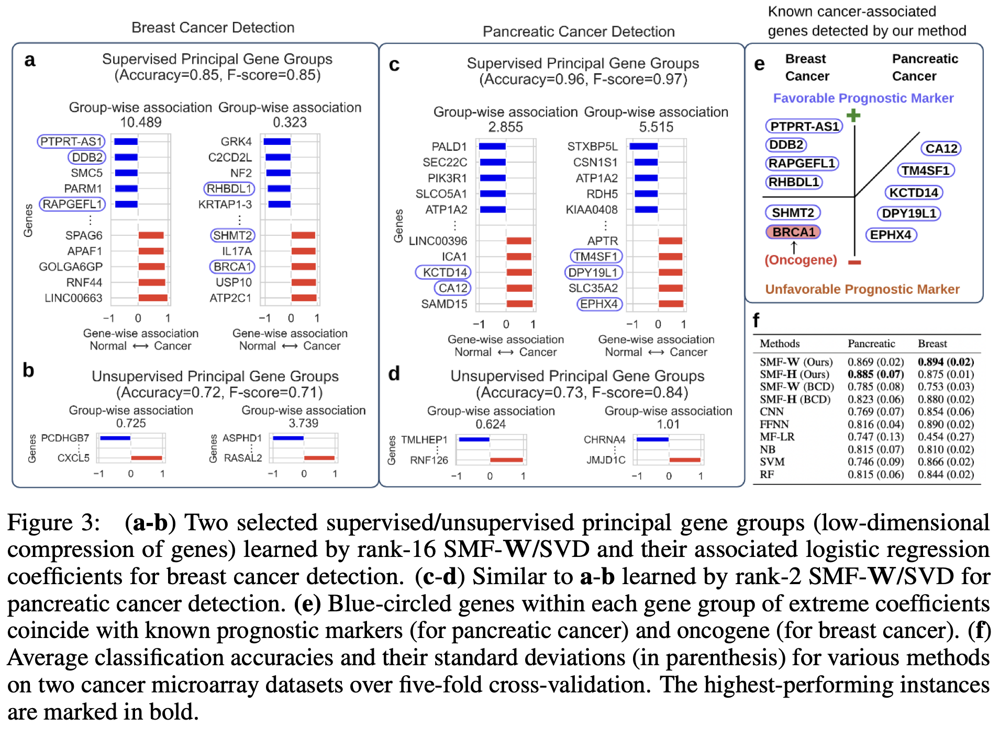

# Supervised Matrix Factorization #
## for simultaneous low-rank compression and classification ##

<br/> This repository contains main source codes for algorithms for SMF in the following papers: <br/>


[1] Joowon Lee, Hanbaek Lyu, Weixin Yao
[*"Exponentially Convergent Algorithms for Supervised Matrix Factorization*"](https://papers.nips.cc/paper_files/paper/2023/hash/f2c80b3c9cf8102d38c4b21af25d9740-Abstract-Conference.html) (NeurIPS 2023)

[2] Joowon Lee, Hanbaek Lyu, Weixin Yao
[*"Supervised Matrix Factorization: Local Landscape Analysis and Applications*"](https://arxiv.org/abs/2102.06984) (ICML 2024)


## Installation

The code in this repository now comes as part of a Python package `SupervisedMF` distributed through [PyPI](https://pypi.org/) available [here](https://pypi.org/project/SupervisedMF/).

To install the package, run the following command in your environment:

```
pip install SupervisedMF
```

To check your installation, try to import the mani classes within this package:

```py
>>> from SMF import SMF_BCD
>>> from SMF import SMF_LPGD
```


&nbsp;
 

&nbsp;


&nbsp;

&nbsp;

&nbsp;

&nbsp;


## Usage

Please see the demo "notebook/SMF_gene_groups_demo.ipynb"
&nbsp;

Then copy & paste the ipynb notebook files into the main folder. Run each Jupyter notebook and see the instructions therein. 

## File description 

  1. **src.SMF.py** : Numpy implementation of SMF_BCD (Block Coordinate Descent, ICML '24) and SMF_LPGD (Low-rank PGD, NeurIPS '23)
  2. **src.SMF_torch.py**: Pytorch implementation of SMF_BCD (ICML '24). It utilizes GPU if available. 
  
## Authors

* **Joowon Lee** - *Initial work* - [Website](https://stat.wisc.edu/staff/lee-joowon/)
* **Hanbaek Lyu** - *Initial work* - [Website](https://hanbaeklyu.com)
* **Weixin Yao** - *Initial work* - [Website](https://faculty.ucr.edu/~weixiny/)

## Code Contributors 
* **Agam Goyal** - [Website](https://agoyal0512.github.io)
* **Yi Wei** - [Website](https://yee-millennium.github.io)
* (Add yours if you make contributions!)

## BibTex citations:

If you find our work useful for yours, please cite the relevant papers using the following BibTex entries:
```bib
@article{lee2024exponentially,
  title={Exponentially convergent algorithms for supervised matrix factorization},
  author={Lee, Joowon and Lyu, Hanbaek and Yao, Weixin},
  journal={Advances in Neural Information Processing Systems},
  volume={36},
  year={2024}
}
```

```bib
@InProceedings{pmlr-v235-lee24p,
  title = 	 {Supervised Matrix Factorization: Local Landscape Analysis and Applications},
  author =       {Lee, Joowon and Lyu, Hanbaek and Yao, Weixin},
  booktitle = 	 {Proceedings of the 41st International Conference on Machine Learning},
  pages = 	 {26752--26788},
  year = 	 {2024},
  editor = 	 {Salakhutdinov, Ruslan and Kolter, Zico and Heller, Katherine and Weller, Adrian and Oliver, Nuria and Scarlett, Jonathan and Berkenkamp, Felix},
  volume = 	 {235},
  series = 	 {Proceedings of Machine Learning Research},
  month = 	 {21--27 Jul},
  publisher =    {PMLR},
  pdf = 	 {https://raw.githubusercontent.com/mlresearch/v235/main/assets/lee24p/lee24p.pdf},
  url = 	 {https://proceedings.mlr.press/v235/lee24p.html},
  abstract = 	 {Supervised matrix factorization (SMF) is a classical machine learning method that seeks low-dimensional feature extraction and classification tasks at the same time. Training an SMF model involves solving a non-convex and factor-wise constrained optimization problem with at least three blocks of parameters. Due to the high non-convexity and constraints, theoretical understanding of the optimization landscape of SMF has been limited. In this paper, we provide an extensive local landscape analysis for SMF and derive several theoretical and practical applications. Analyzing diagonal blocks of the Hessian naturally leads to a block coordinate descent (BCD) algorithm with adaptive step sizes. We provide global convergence and iteration complexity guarantees for this algorithm. Full Hessian analysis gives minimum $L_{2}$-regularization to guarantee local strong convexity and robustness of parameters. We establish a local estimation guarantee under a statistical SMF model. We also propose a novel GPU-friendly neural implementation of the BCD algorithm and validate our theoretical findings through numerical experiments. Our work contributes to a deeper understanding of SMF optimization, offering insights into the optimization landscape and providing practical solutions to enhance its performance.}
}
```

## License

This project is licensed under the MIT License - see the [LICENSE.md](https://github.com/ljw9510/SMF/blob/main/LICENSE) file for details

